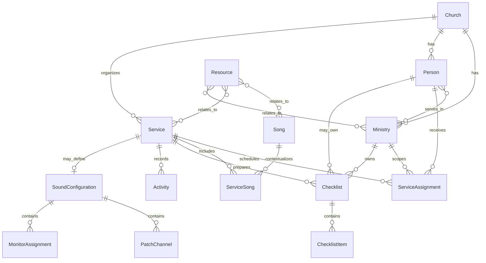

# Modelo de dominio

**Estado:** Aceptado para implementación inicial

## Mapa conceptual



## Agregados

### Church

Raíz organizacional. En el MVP existe una iglesia demo, pero todas las entidades de negocio incluyen `churchId` para no bloquear multi-tenant futuro. La separación real entre tenants se implementará con el backend.

### Service

Agregado operacional principal. Contiene referencias a su preparación, no copias de personas o canciones. Sus métricas se calculan desde asignaciones, repertorio y checklists.

### Song y ServiceSong

`Song` es la biblioteca global. `ServiceSong` es la interpretación contextual en un servicio. Esta frontera evita que un cambio de tonalidad local corrompa la biblioteca.

### Person y User

`Person` representa a quien participa en la iglesia. `User` representa acceso e identidad digital. En el MVP demo pueden vincularse uno a uno, pero siguen siendo conceptos separados para permitir personas aún no registradas y futuras políticas de acceso.

## Contratos TypeScript propuestos

```ts
type Id = string;
type ISODateTime = string;

interface Entity {
  id: Id;
  churchId: Id;
  createdAt: ISODateTime;
  updatedAt: ISODateTime;
}

interface Person extends Entity {
  firstName: string;
  lastName: string;
  avatarUrl?: string;
  phone?: string;
  ministryIds: Id[];
  role: "admin" | "pastor" | "leader" | "server" | "guest";
  availability: AvailabilityRule[];
  status: "active" | "inactive";
}

interface Service extends Entity {
  name: string;
  type: "worship" | "rehearsal" | "conference" | "youth" | "meeting" | "specialEvent";
  startsAt: ISODateTime;
  endsAt: ISODateTime;
  location: string;
  description?: string;
  status: "planning" | "organizing" | "confirming" | "ready" | "completed" | "archived";
  ministryIds: Id[];
  relatedServiceId?: Id;
  notes?: string;
}

interface ServiceAssignment extends Entity {
  serviceId: Id;
  personId: Id;
  ministryId: Id;
  functionName: string;
  attendanceStatus: "pending" | "confirmed" | "declined" | "late";
  attendanceUpdatedAt?: ISODateTime;
  notes?: string;
}

interface Song extends Entity {
  title: string;
  author: string;
  originalKey: MusicalKey;
  defaultBpm?: number;
  durationSeconds?: number;
  timeSignature?: string;
  tags: string[];
}

interface ServiceSong extends Entity {
  serviceId: Id;
  songId: Id;
  order: number;
  key: MusicalKey;
  bpm?: number;
  version?: string;
  notes?: string;
  enabled: boolean;
}

interface Resource extends Entity {
  name: string;
  type: "pdf" | "sheetMusic" | "chordChart" | "sequence" | "multitrack" |
    "audio" | "video" | "image" | "document" | "other";
  uri: string;
  songIds: Id[];
  serviceIds: Id[];
  ministryIds: Id[];
}

interface Checklist extends Entity {
  name: string;
  serviceId?: Id;
  ministryId?: Id;
  personId?: Id;
  phase?: "preparation" | "soundcheck" | "rehearsal" | "start" | "finish";
}

interface ChecklistItem extends Entity {
  checklistId: Id;
  title: string;
  order: number;
  completed: boolean;
  completedByPersonId?: Id;
  completedAt?: ISODateTime;
}

interface Activity extends Entity {
  serviceId: Id;
  actorPersonId: Id;
  type: string;
  entityType: string;
  entityId: Id;
  summary: string;
  metadata?: Record<string, string | number | boolean | null>;
}
```

`AvailabilityRule`, `MusicalKey`, configuraciones de sonido y permisos tendrán tipos propios; no se modelarán como texto libre cuando comiencen a gobernar comportamiento.

## Invariantes

1. `ServiceSong.songId` referencia una canción existente y su `key` nunca actualiza `Song.originalKey`.
2. `ServiceAssignment` no duplica nombre, avatar ni nombre de ministerio.
3. Solo el usuario asociado a `personId` puede cambiar su asistencia mediante la experiencia de servidor.
4. Un `Resource` debe tener al menos una relación de dominio.
5. Un `Checklist` debe tener al menos un propietario contextual: servicio, ministerio o persona.
6. `order` es único dentro del repertorio o checklist correspondiente y se normaliza después de reordenar.
7. Fechas se guardan como ISO 8601; presentación y zona horaria se resuelven en UI.
8. Actividad es append-only desde la interfaz normal.
9. Contadores y estados agregados se calculan; no se guardan como campos paralelos.

## Política temporal

El MVP opera en `America/Santiago` para los datos demo. La persistencia usa instantes ISO y la UI formatea según la configuración de iglesia. Esta decisión evita mezclar textos de fecha con valores operables.

## Borrado e historial

Se prefiere archivar servicios y desactivar personas para preservar referencias. El borrado físico de datos relacionados necesita una política explícita antes de implementarse. Restablecer datos demo es la excepción deliberada y reemplaza el store local completo tras confirmación.

