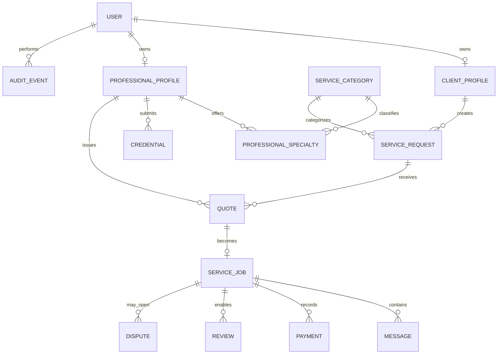

# Modelo de dominio

**Estado:** Propuesto para el MVP

## Mapa conceptual

## Agregados

### Usuario y perfiles

`User` concentra identidad digital y estado de cuenta. `ClientProfile` y `ProfessionalProfile` modelan capacidades diferentes sin duplicar autenticación. Los privilegios administrativos se asignan explícitamente.

### Profesional y credenciales

La especialidad ofrecida se vincula a una categoría. `Credential` representa evidencia y decisión de revisión; el distintivo visible se deriva de credenciales aprobadas y vigentes.

### Solicitud y cotización

`ServiceRequest` describe la necesidad del cliente sin publicarla de forma indiscriminada. `Quote` es la propuesta comercial del profesional. Una cotización aceptada origina un `ServiceJob` inmutablemente relacionado.

### Servicio

`ServiceJob` es el centro operacional: agenda, participantes, estado, mensajes, pagos, cierre, disputa y evaluación. No duplica el contenido histórico de solicitud o cotización.

### Pago

`Payment` registra referencias y estados del proveedor; no contiene tarjeta. La comisión se guarda como desglose auditable del momento de la transacción.

## Entidades mínimas

| Entidad | Datos principales |
| --- | --- |
| User | identidad, roles, estado, consentimiento |
| ClientProfile | nombre visible y preferencias |
| ProfessionalProfile | presentación, cobertura, disponibilidad, reputación derivada |
| ServiceCategory | gas, electricidad, agua y requisitos |
| Credential | tipo, emisor, vigencia, evidencia, estado, revisión |
| ServiceRequest | cliente, categoría, descripción, zona, urgencia, disponibilidad, estado |
| Quote | solicitud, profesional, alcance, precio, fecha, vigencia, estado |
| ServiceJob | cotización, agenda, ubicación autorizada, estado y participantes |
| Message | conversación, autor, contenido y fecha |
| Payment | servicio, proveedor, montos, comisión, estado y referencia |
| Review | servicio, autor, destinatario, puntuación y moderación |
| Dispute | servicio, iniciador, motivo, evidencia, estado y resolución |
| AuditEvent | actor, acción, objetivo, fecha y metadatos seguros |

## Estados principales

| Concepto | Estados |
| --- | --- |
| Solicitud | `draft`, `published`, `quoted`, `assigned`, `cancelled`, `expired` |
| Cotización | `draft`, `submitted`, `accepted`, `rejected`, `withdrawn`, `expired` |
| Servicio | `scheduled`, `inProgress`, `awaitingClient`, `completed`, `cancelled`, `disputed` |
| Credencial | `draft`, `submitted`, `underReview`, `approved`, `rejected`, `expired` |
| Pago | `created`, `authorized`, `held`, `released`, `refunded`, `failed` |
| Disputa | `open`, `underReview`, `resolved`, `rejected` |

## Invariantes

1. Una cotización aceptada pertenece a la misma solicitud y profesional del servicio creado.
2. Solo una cotización puede estar aceptada por solicitud.
3. “Verificado” se deriva de evidencia aprobada y vigente para la especialidad.
4. Solo los participantes de un servicio completado pueden evaluarse.
5. El total de pago equivale al monto del profesional, comisión, impuestos y ajustes registrados.
6. Una liberación o reembolso usa una clave idempotente y no puede duplicarse.
7. La dirección exacta se expone únicamente a participantes autorizados y en la etapa necesaria.
8. Una suspensión o moderación conserva motivo, actor y fecha.
9. Archivos privados no son accesibles mediante URL pública permanente.
10. Eliminaciones legales anonimizan lo permitido sin romper registros financieros obligatorios.

## Frontera multiusuario

Toda consulta se limita por identidad, rol y relación con el recurso. El cliente ve sus solicitudes; el profesional, oportunidades autorizadas y sus trabajos; el administrador accede solo a las funciones de control asignadas. La interfaz no constituye una frontera de seguridad.

