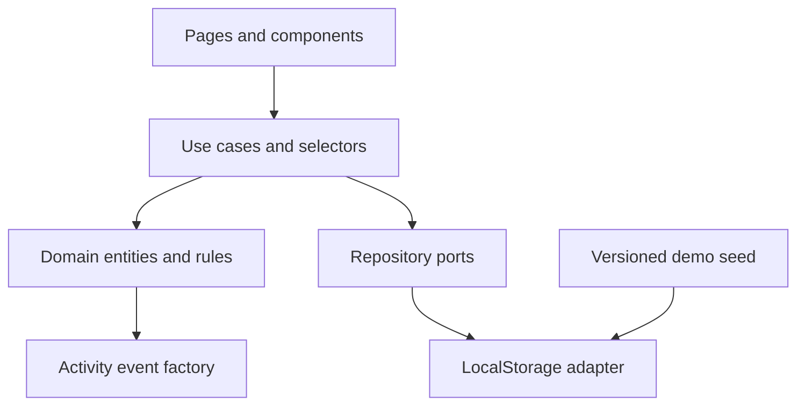

# Arquitectura técnica

**Estado:** Propuesto para el MVP local

## Decisiones base

- React + TypeScript + Vite.
- Tailwind CSS y shadcn/ui para fundamentos visuales accesibles.
- Lucide para iconografía y Framer Motion para movimiento intencional.
- Zustand con middleware de persistencia como store central propuesto.
- React Router para rutas y navegación canónica.
- LocalStorage como adaptador de persistencia, nunca accedido directamente desde componentes.
- Datos demo deterministas y versionados.

Las dependencias de routing, estado, formularios, drag and drop y testing se confirmarán al inicializar el proyecto y quedarán registradas en ADRs.

## Capas



- **UI:** representación, interacción y accesibilidad.
- **Application:** casos de uso como confirmar, duplicar, reordenar o restablecer.
- **Domain:** tipos, invariantes, permisos, cálculos y validación.
- **Infrastructure:** LocalStorage, serialización, migraciones y datos demo.

La regla principal es que los componentes no mutan colecciones arbitrariamente. Invocan acciones de aplicación que validan reglas y producen actividad.

## Estructura propuesta

```text
src/
  app/                 # router, providers, shell y configuración
  components/          # UI transversal y primitives
  features/
    activity/
    calendar/
    checklists/
    ministries/
    people/
    resources/
    services/
    songs/
    sound/
  domain/              # entidades, reglas, permisos y value objects
  store/               # slices, selectors y acciones orquestadas
  infrastructure/      # LocalStorage, migraciones y seed demo
  lib/                 # utilidades sin conocimiento del dominio
  test/                # factories y configuración compartida
```

Cada feature expone una interfaz pública mínima. Las importaciones entre features pasan por dominio o casos de uso compartidos para evitar ciclos.

## Persistencia

El store persistido usa una única envoltura versionada:

```ts
interface PersistedState<T> {
  schemaVersion: number;
  savedAt: string;
  data: T;
}
```

Requisitos:

- clave propuesta: `ruahtone:mvp`;
- validación del payload al hidratar;
- migración explícita por `schemaVersion`;
- fallback seguro al seed ante datos irreparables;
- reset confirmado que reinstala una copia nueva del seed;
- fechas serializadas como ISO, sin instancias `Date` persistidas.

## Estado y selectores

Las entidades se normalizan por ID. Los selectores calculan confirmaciones, progreso, alertas, historial de canción y cambios del servicio. La UI no mantiene copias locales de datos persistentes salvo borradores de formulario.

## Permisos del demo

Una matriz central decide capacidades a partir de usuario, rol, contexto y ministerio. Ocultar una acción mejora la UX, pero las acciones del store también validan autorización para que el modelo no dependa de la vista.

## Actividad transaccional

Una acción relevante actualiza la entidad y agrega su registro de actividad en la misma operación del store. Si una validación falla, ninguna parte se persiste. El texto se genera desde eventos tipados para mantener consistencia.

## Tratamiento de archivos

Como no existe almacenamiento real, los recursos demo usan metadatos y URIs simuladas o estáticas claramente identificadas. No se promete upload cloud. La interfaz puede seleccionar archivos solo si explica que su persistencia es limitada; la alternativa inicial preferida es agregar un recurso demo mediante formulario.

## Evolución a backend

Los puertos de repositorio separan casos de uso de LocalStorage. La futura API reemplazará adaptadores, añadirá identidad real, autorización del lado servidor, auditoría y aislamiento por iglesia. El MVP no debe fingir garantías de seguridad que el navegador no puede ofrecer.

