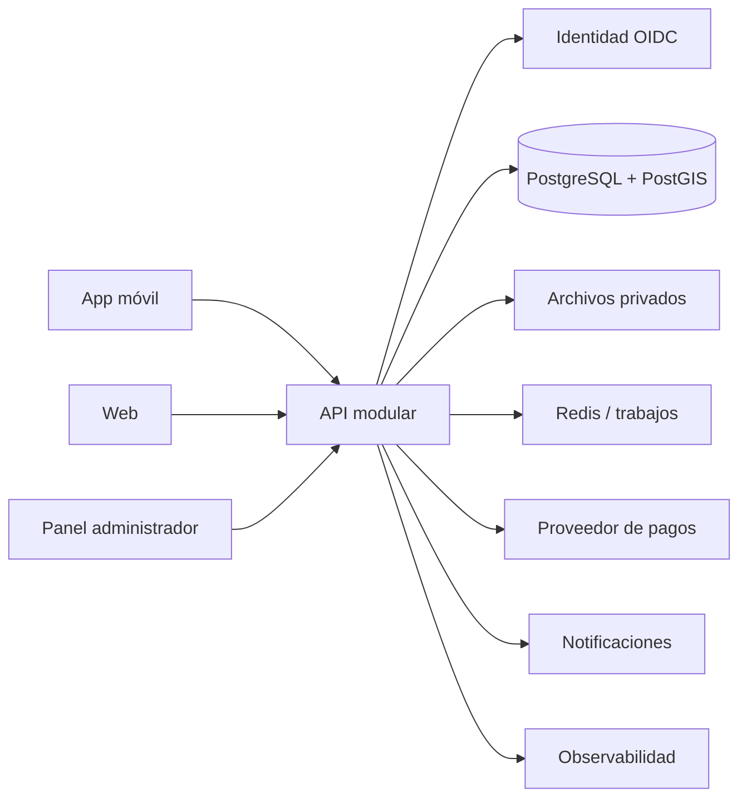

# Arquitectura técnica

**Estado:** Propuesta para evaluación

**Principio:** comenzar con un monolito modular y límites claros; distribuir solo cuando la operación lo justifique.

## Stack recomendado

| Capa | Tecnología | Motivo |
| --- | --- | --- |
| Móvil | React Native + Expo + TypeScript | una base para iOS/Android y velocidad de iteración |
| Web | Next.js + TypeScript | paneles, accesibilidad, renderizado y ecosistema sólido |
| API | NestJS + TypeScript | módulos explícitos, validación, pruebas y lenguaje compartido |
| Datos | PostgreSQL + PostGIS | transacciones, relaciones, geodatos y consultas auditables |
| Caché/colas | Redis | rate limits, trabajos breves y coordinación temporal |
| Archivos | almacenamiento S3 compatible | documentos privados con URLs firmadas y ciclo de vida |
| Identidad | proveedor OIDC gestionado | MFA, recuperación y menor riesgo de implementación propia |
| Pagos | proveedor con soporte en Chile | tokenización, webhooks y conciliación |
| Observabilidad | OpenTelemetry + servicio gestionado | trazas, métricas y errores sin exponer datos sensibles |
| Infraestructura | nube gestionada + IaC | respaldos, despliegue repetible y escalamiento gradual |

Las alternativas deben evaluarse por soporte en Chile, costos reales, experiencia del equipo y requisitos regulatorios. No se selecciona proveedor de pago ni nube sin una comparación documentada.

## Arquitectura lógica

## Módulos del backend

Identidad y acceso, perfiles, categorías, verificación, búsqueda, solicitudes, cotizaciones, servicios, mensajería, pagos, reputación, disputas, administración, notificaciones y auditoría.

Cada módulo mantiene reglas propias y publica eventos internos. En la etapa inicial se despliegan juntos; esto reduce complejidad sin perder fronteras para una evolución futura.

## Estrategia del MVP académico

El prototipo puede usar una API local o servicio gestionado de desarrollo, base de datos con datos ficticios y adaptadores simulados para pago, revisión y mensajería. Los contratos de esos adaptadores deben parecerse a los reales para evitar reescribir el dominio.

## Seguridad y privacidad

- Control de acceso por rol y pertenencia al recurso.
- MFA obligatorio para administración y recomendado para profesionales.
- Cifrado, rotación de secretos y separación de ambientes.
- URLs firmadas de corta duración para evidencia documental.
- Validación de archivos, tamaño, tipo y análisis antimalware.
- Webhooks firmados e idempotentes para pagos.
- Rate limiting, protección contra enumeración y registro de auditoría.
- Minimización, retención y borrado definidos por clase de dato.
- Geolocalización aproximada para búsqueda; dirección exacta solo en etapa autorizada.

## Despliegue inicial

Ambientes separados de desarrollo, pruebas y producción. CI ejecuta formato, tipos, pruebas, análisis de dependencias y build. Las migraciones son versionadas, los respaldos automáticos y la restauración se prueba periódicamente.

## Decisiones pendientes

- proveedor de identidad;
- proveedor de pagos compatible con el modelo comercial chileno;
- estrategia legal de retención y verificación de credenciales;
- proveedor cloud y región;
- necesidad real de chat en tiempo real frente a mensajería asincrónica;
- objetivos de disponibilidad y tiempos de respuesta para el piloto.
